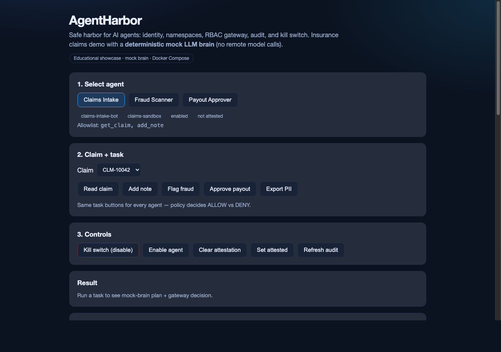
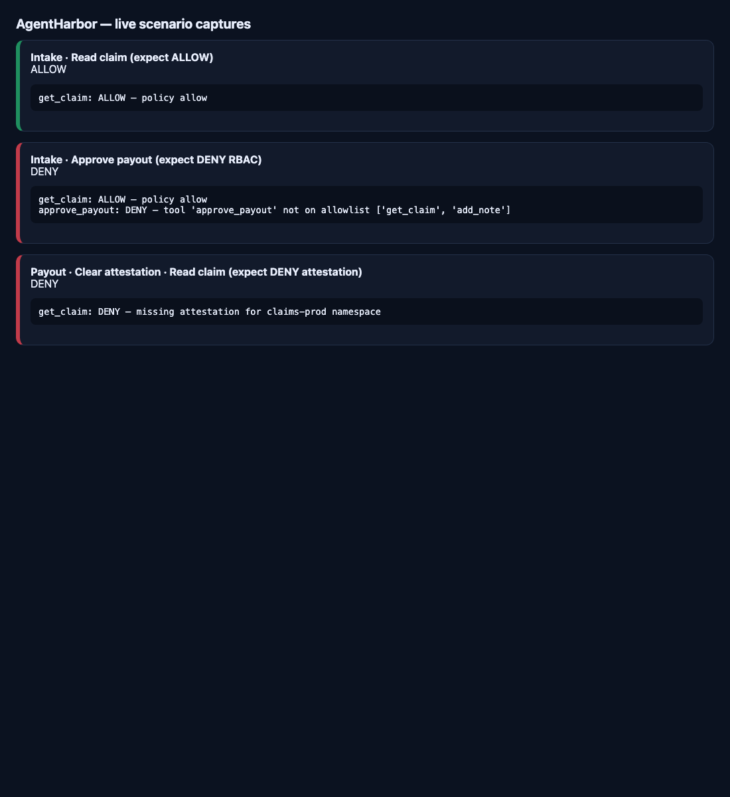

# Demo behaviors (ALLOW vs DENY)

This page is the **expected behavior** guide for the UI at http://localhost:3000.  
Screenshots are optional visual aids under [`docs/images/`](./images/); behavior below is authoritative.

## Mental model

1. **Mock brain** plans tools from the **task** (even if the agent is not allowed).  
2. **Gateway** decides ALLOW/DENY from agent policy.  
3. **Audit** records every tool decision.

Attestation is **not** global. It only applies to agents in the **`claims-prod`** namespace.

## Agents (policy card)

| UI name | Agent ID | Namespace | Allowlist | Attestation matters? |
| --- | --- | --- | --- | --- |
| Claims Intake | `claims-intake-bot` | `claims-sandbox` | `get_claim`, `add_note` | **No** — sandbox ignores attestation |
| Fraud Scanner | `fraud-scanner-bot` | `claims-sandbox` | `get_claim`, `flag_fraud` | **No** |
| Payout Approver | `payout-approver-bot` | `claims-prod` | `get_claim`, `approve_payout` | **Yes** — must be attested |

## Policy order

Evaluated for **each** planned tool:

1. Agent **disabled** (kill switch) → **DENY** — `agent disabled (kill switch)`  
2. Namespace is `claims-prod` **and** `attested == false` → **DENY** — `missing attestation for claims-prod namespace`  
3. Tool **not** on allowlist → **DENY** — `tool '…' not on allowlist […]`  
4. Else → **ALLOW** and call mcp-claims  

## Expected UI clicks

### RBAC (allowlist)

| Agent | Task | Expected |
| --- | --- | --- |
| Claims Intake | Read claim | **ALLOW** |
| Claims Intake | Add note | **ALLOW** |
| Claims Intake | Approve payout | **DENY** (not on allowlist; `get_claim` may ALLOW first, then `approve_payout` DENY) |
| Claims Intake | Export PII | **DENY** |
| Claims Intake | Flag fraud | **DENY** |
| Fraud Scanner | Flag fraud | **ALLOW** |
| Fraud Scanner | Approve payout | **DENY** |
| Payout Approver (attested, enabled) | Approve payout | **ALLOW** |
| Payout Approver | Export PII | **DENY** |

### Attestation (common confusion)

| Steps | Expected |
| --- | --- |
| Select **Claims Intake** → **Clear attestation** → **Read claim** | **ALLOW** — sandbox does not require attestation |
| Select **Payout Approver** → **Clear attestation** → **Read claim** | **DENY** — prod requires attestation for *every* tool, including read |
| Payout Approver → **Set attested** → **Approve payout** | **ALLOW** |

### Kill switch

| Steps | Expected |
| --- | --- |
| Any agent → **Kill switch (disable)** → any task | **DENY** — `agent disabled (kill switch)` |
| **Enable agent** → allowed task | **ALLOW** again (if other rules pass) |

## Multi-step plans

For tasks that plan two tools (e.g. Approve payout = `get_claim` then `approve_payout`):

- Overall decision is **DENY** if **any** step is denied.  
- Earlier steps may still show **ALLOW** in the JSON / audit (e.g. Intake can read, then deny approve).

## Screenshots

Checked in under [`docs/images/`](./images/):

| File | What it shows |
| --- | --- |
|  | Main demo UI (agents, tasks, controls). Intake can be `not attested` and still run in sandbox. |
|  | Live captures: Intake Read **ALLOW**; Intake Approve **DENY** (RBAC); Payout without attestation Read **DENY** |

Capture helper page (for regenerating scenario image): [`images/capture-scenarios.html`](./images/capture-scenarios.html).
